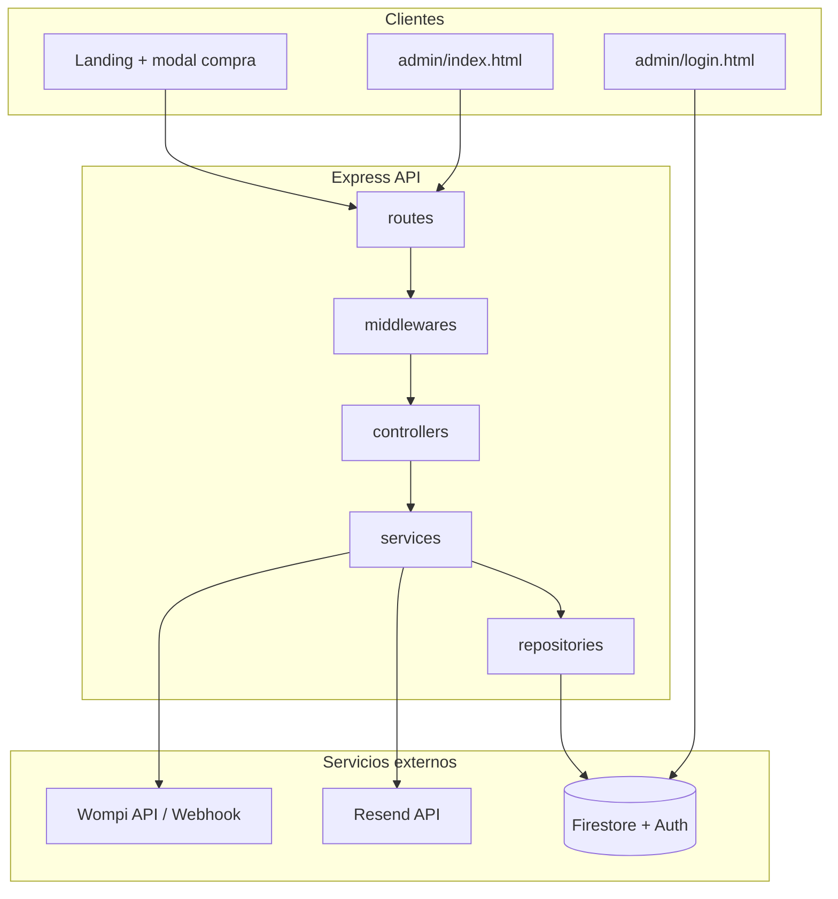
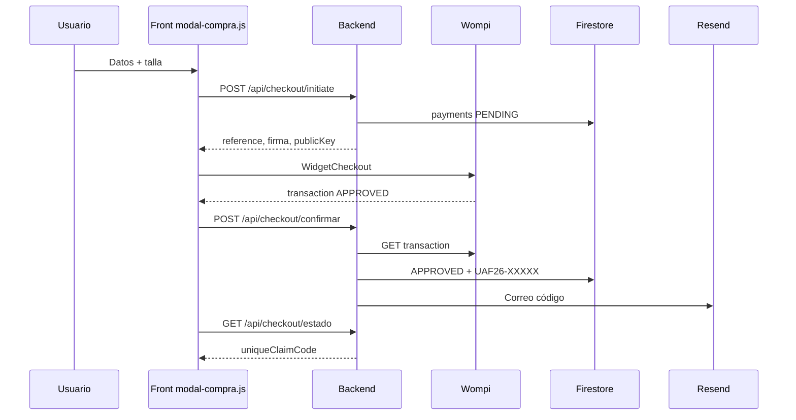
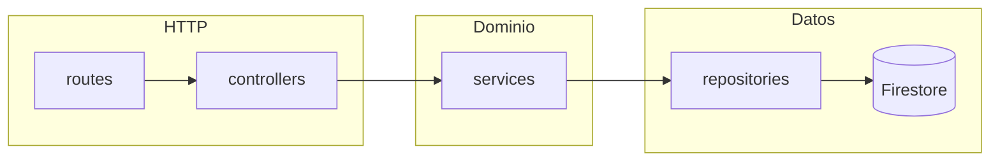
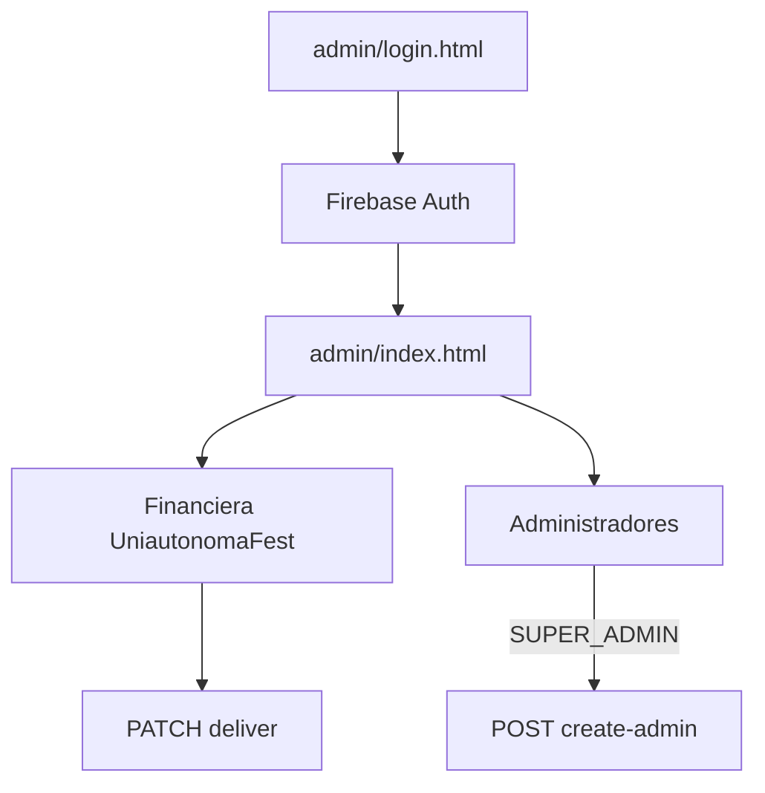

# Uniautónoma Fest 2026 — Plataforma de kits, pagos y admin

Sistema integral para la venta de kits del **Uniautónoma Fest 2026**: landing pública, checkout con **Wompi**, códigos de reclamo **UAF26-XXXXX**, correos con **Resend**, persistencia en **Firestore** y panel administrativo con **Firebase Auth**.

Documento de especificación funcional ampliada: [`Contexto.md`](Contexto.md).

---

## Tabla de contenidos

1. [Funcionalidad](#funcionalidad)
2. [Stack tecnológico](#stack-tecnológico)
3. [Arquitectura](#arquitectura)
4. [Principios SOLID y patrones](#principios-solid-y-patrones)
5. [Integración Wompi](#integración-wompi)
6. [Integración Resend](#integración-resend)
7. [Modelo de datos (Firestore)](#modelo-de-datos-firestore)
8. [Distribución de ficheros](#distribución-de-ficheros)
9. [Instalación](#instalación)
10. [Uso y URLs](#uso-y-urls)
11. [API REST](#api-rest)
12. [Seguridad](#seguridad)
13. [Scripts útiles](#scripts-útiles)
14. [Despliegue (Vercel)](#despliegue-vercel)
15. [Diagramas](#diagramas)

---

## Funcionalidad

| Módulo | Descripción |
|--------|-------------|
| **Landing** | Sitio estático del fest (`index.html`): información del evento, sección kit, modal de compra integrado. |
| **Checkout (front)** | Formulario con talla, datos personales, widget **Wompi**, polling/confirmación y visualización del código de reclamo. |
| **Checkout (API)** | Valida reglas de negocio, crea pago `PENDING`, firma de integridad Wompi, confirma transacción y expone estado. |
| **Pagos / webhook** | Recibe eventos Wompi firmados, aprueba pago, genera código y dispara correo. |
| **Correos** | Plantilla HTML con código, talla y kit; reintentos e idempotencia Resend. |
| **Admin — login** | Página dedicada [`admin/login.html`](admin/login.html): solo autenticación Firebase (sin credenciales en HTML). |
| **Admin — panel** | [`admin/index.html`](admin/index.html): pestaña **Financiera UniautonomaFest** (entregas, Excel) y **Administradores** (super admin). |

### Reglas de negocio

- **Kit Uniautónomo (`uniautonomo`)**: correo `@uniautonoma.edu.co` y código de estudiante obligatorios.
- **Kit Corredor (`general`)**: participantes externos; sin código estudiante.
- **Montos (centavos COP)**: Sangre Azul `7_500_000` (75 000 COP), Corredor `8_000_000` (80 000 COP), configurables en `.env`.
- **Código de reclamo**: formato `UAF26-XXXXX` al aprobar el pago.
- **Anti-duplicados**: reutiliza checkout `PENDING` reciente mismo email+kit; confirmación idempotente si ya está `APPROVED`.

---

## Stack tecnológico

| Capa | Tecnología |
|------|------------|
| Runtime | Node.js 20+ |
| API | Express 4 |
| Base de datos | Cloud Firestore (Firebase Admin SDK) |
| Autenticación admin | Firebase Auth (email/contraseña) + custom claims |
| Pasarela | Wompi (widget + API + webhooks) |
| Email transaccional | Resend |
| Front público | HTML, CSS, JavaScript vanilla |
| Admin | HTML + ES modules + SheetJS (export Excel) |
| Despliegue | Vercel (`vercel.json` + serverless `api/index.js`) |

---

## Arquitectura

Arquitectura en capas (**Clean Architecture** simplificada) en `backend/src/`:



**Flujo de compra (resumen):**



En **producción**, Wompi también puede notificar vía `POST /api/payments/webhook` (misma lógica de aprobación en `confirmacionPago.service.js`).

---

## Principios SOLID y patrones

| Principio | Cómo se aplica en el proyecto |
|-----------|------------------------------|
| **S — Responsabilidad única** | `correo.service.js` solo envía; `pagos.repository.js` solo Firestore; `validacionKit.service.js` solo reglas de kit. |
| **O — Abierto/cerrado** | Nuevos estados Wompi o tipos de kit se extienden en servicios sin reescribir controladores. |
| **L — Sustitución** | Roles `ADMIN` / `SUPER_ADMIN` comparten middleware base `requireAuth` + `requireAdmin`. |
| **I — Segregación de interfaces** | Controladores delgados; repositorios exponen operaciones concretas (`marcarAprobado`, `listarPagos`). |
| **D — Inversión de dependencias** | Servicios dependen de repositorios y config, no de Express; Firebase se inyecta vía `config/firebase.js`. |

**Patrones usados:**

- **Repository**: acceso a `payments` y `admins`.
- **Service layer**: checkout, webhook, correo, validación Wompi.
- **Middleware chain**: auth, RBAC, firma webhook, rate limit en checkout.
- **Idempotencia**: pagos ya `APPROVED`; claves Resend por pago; reenvío correo controlado.

---

## Integración Wompi

| Variable `.env` | Uso |
|-----------------|-----|
| `WOMPI_PUBLIC_KEY` | Widget y consulta de transacciones (`pub_test_` / `pub_prod_`) |
| `WOMPI_INTEGRITY_SECRET` | Firma SHA256 del checkout (`reference` + monto + moneda) |
| `WOMPI_EVENTS_SECRET` | Validación firma del webhook |

**Archivos clave:**

- [`backend/src/services/wompiIntegridad.service.js`](backend/src/services/wompiIntegridad.service.js) — firma para el widget.
- [`backend/src/services/wompiTransaccion.service.js`](backend/src/services/wompiTransaccion.service.js) — consulta transacción tras cerrar widget.
- [`backend/src/services/wompiWebhook.service.js`](backend/src/services/wompiWebhook.service.js) — eventos `transaction.updated`.
- [`backend/src/middlewares/verifyWebhookSignature.js`](backend/src/middlewares/verifyWebhookSignature.js) — integridad del POST webhook.
- [`js/modal-compra.js`](js/modal-compra.js) — widget y confirmación en front.

**Local vs producción:**

- **Local**: `POST /api/checkout/confirmar` evita depender de ngrok.
- **Producción**: registrar URL de eventos → `https://<tu-dominio>/api/payments/webhook`.

---

## Integración Resend

| Variable | Uso |
|----------|-----|
| `RESEND_API_KEY` | API key (`re_...`) |
| `CORREO_REMITENTE` | Remitente `from` (dominio verificado o `onboarding@resend.dev` en pruebas) |
| `RESEND_CORREO_SANDBOX` | En dev: redirige destinatarios cuando el remitente es sandbox |

**Archivos:** [`correo.service.js`](backend/src/services/correo.service.js), [`correoReclamo.service.js`](backend/src/services/correoReclamo.service.js), [`validarRemitenteResend.js`](backend/src/utilidades/validarRemitenteResend.js).

---

## Modelo de datos (Firestore)

### Colección `payments`

Campos principales: `reference`, `transactionId`, `personalInfo` (nombres, email, `studentCode`, `shirtSize`), `kitType`, `amount`, `status`, `uniqueClaimCode`, `kitClaimed`, `claimedByAdminEmail`, `emailEnviadoEn`, `emailError`, `createdAt`.

### Colección `admins`

`uid`, `email`, `role` (`ADMIN` | `SUPER_ADMIN`), `createdAt`.

Reglas: [`firebase/firestore.rules`](firebase/firestore.rules) — escritura solo vía **Firebase Admin** en el backend; clientes no acceden directo a `payments`.

---

## Distribución de ficheros

```
uniautonoma-fest-2026/
├── README.md                 ← Este documento
├── Contexto.md               ← Especificación maestra del proyecto
├── index.html                ← Landing + modal de compra
├── js/
│   └── modal-compra.js       ← Flujo Wompi en la landing
├── img/                      ← Assets del sitio
├── admin/
│   ├── login.html            ← Login (Firebase Auth)
│   ├── index.html            ← Panel (Financiera + Administradores)
│   ├── css/admin.css
│   └── js/
│       ├── firebase-cliente.js
│       ├── login.js
│       └── admin.js
├── checkout/                 ← Redirección / legacy checkout
├── api/
│   └── index.js              ← Entrada Vercel → backend Express
├── backend/
│   ├── .env.example
│   ├── package.json
│   ├── scripts/              ← semilla admin, probar correo, reenviar, etc.
│   └── src/
│       ├── servidor.js       ← Arranque local
│       ├── app.js            ← Express + estáticos
│       ├── config/           ← firebase, wompi, resend, env
│       ├── routes/
│       ├── controllers/
│       ├── middlewares/
│       ├── services/
│       ├── repositories/
│       └── utilidades/
├── firebase/
│   └── firestore.rules
└── vercel.json
```

---

## Instalación

### 1. Clonar e instalar

```bash
cd backend
npm install
```

(Opcional: dependencias en raíz si usas el `package.json` del monorepo.)

### 2. Variables de entorno

```bash
cp backend/.env.example backend/.env
```

Completa Firebase, Wompi, Resend y montos. Para Firebase Admin en local, lo más simple:

```bash
# Copiar JSON de cuenta de servicio a backend/service-account.json
# GOOGLE_APPLICATION_CREDENTIALS=./service-account.json
```

### 3. Firebase

- Crear proyecto Firestore + Auth (email/contraseña).
- Desplegar reglas: `firebase deploy --only firestore` (desde carpeta con `.firebaserc`).
- Crear índice compuesto si filtras admin por `status` + `createdAt` en `payments`.

### 4. Super administrador

```bash
cd backend
npm run semilla-admin
```

### 5. Arrancar en local

```bash
cd backend
npm run dev
```

Servidor: `http://localhost:3000` (API + estáticos landing/admin).

---

## Uso y URLs

| URL | Descripción |
|-----|-------------|
| `/` | Landing Uniautónoma Fest 2026 |
| `/?comprar=kit` | Abre modal de compra |
| `/admin/login.html` | Inicio de sesión admin |
| `/admin/` | Panel (requiere sesión Firebase) |
| `/api/health` | Health check |

### Panel admin

1. Entrar en **`/admin/login.html`** con usuario creado en Firebase.
2. Tras login → **`/admin/`**.
3. **Financiera UniautonomaFest**: buscar, paginar (6 filas), marcar entregado (confirmación Sí/No), exportar Excel (nombres en columnas separadas).
4. **Administradores** (solo super admin): listar admins y crear nuevos.

---

## API REST

| Método | Ruta | Auth | Descripción |
|--------|------|------|-------------|
| GET | `/api/health` | — | Estado del servicio |
| GET | `/api/config/publica` | — | Firebase + llave pública Wompi |
| POST | `/api/checkout/initiate` | — | Inicia pago |
| POST | `/api/checkout/confirmar` | — | Confirma con Wompi + código + correo |
| GET | `/api/checkout/estado?reference=` | — | Estado y código; reintento correo |
| POST | `/api/payments/webhook` | Firma Wompi | Eventos de pago |
| GET | `/api/admin/perfil` | Bearer | Rol del admin |
| GET | `/api/admin/students` | Admin | Listado paginado/filtros |
| PATCH | `/api/admin/students/:id/deliver` | Admin | Marcar kit entregado |
| GET | `/api/admin/admins` | Super admin | Listar administradores |
| POST | `/api/admin/create-admin` | Super admin | Crear admin |

Detalle operativo adicional: [`backend/README.md`](backend/README.md).

---

## Seguridad

- **Admin**: login separado del panel; contraseñas solo en Firebase Auth / `.env` del servidor (semilla).
- **API admin**: JWT Firebase (`Authorization: Bearer`).
- **RBAC**: claims `admin` / `superAdmin` + documento en `admins`.
- **Firestore**: sin acceso directo del navegador a `payments`.
- **Webhook Wompi**: verificación criptográfica del cuerpo.
- **Rate limit** en rutas de checkout.
- **No commitear** `.env`, `service-account.json` ni API keys.

---

## Scripts útiles

Desde `backend/`:

| Comando | Descripción |
|---------|-------------|
| `npm run dev` | Servidor con watch |
| `npm run semilla-admin` | Crea/actualiza super admin desde `.env` |
| `npm run verificar-admin` | Comprueba usuario semilla en Firebase |
| `npm run probar-correo -- email@ejemplo.com` | Prueba Resend |
| `npm run reenviar-correo -- UAF26-PAY-REF` | Reenvía código para un pago aprobado |

---

## CI/CD y Gitflow

- **Gitflow**: ramas `main` (producción), `develop` (integración), `feature/*`, `release/*`, `hotfix/*`. Guía: [`docs/GITFLOW.md`](docs/GITFLOW.md).
- **CI** (GitHub Actions): verificación de sintaxis del backend y entrada Vercel en cada push/PR compatible.
- **CD** (GitHub Actions → Vercel): `main` → producción; `develop` y PRs → preview.

Configuración de secretos, entornos y checklist: [`docs/CICD.md`](docs/CICD.md).

```bash
# Verificación local (misma base que CI)
npm run ci
```

## Despliegue (Vercel)

1. Conectar repositorio en Vercel (opcional si usas solo GitHub Actions CD).
2. Configurar secretos `VERCEL_TOKEN`, `VERCEL_ORG_ID`, `VERCEL_PROJECT_ID` en GitHub.
3. Copiar variables de `backend/.env.example` a Vercel (Production / Preview).
4. `vercel.json` enruta `/api/*` al handler Node y sirve estáticos (`/`, `/admin`, `/checkout`).
5. Webhook Wompi → `https://<dominio>/api/payments/webhook`.
6. Dominio Resend verificado y `CORREO_REMITENTE` en producción.

---

## Diagramas

### Capas del backend



### Roles administrativos



---

## Licencia y créditos

Proyecto académico / institucional **Uniautónoma Fest 2026**. Para dudas de configuración Wompi, Resend o Firebase, revisa los checklists en [`backend/README.md`](backend/README.md).
