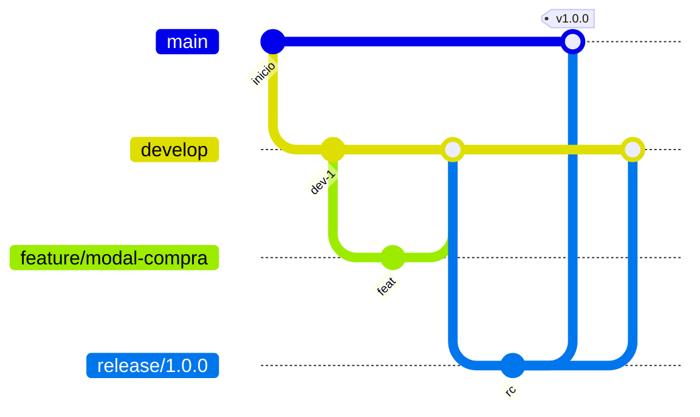

# Gitflow — Uniautónoma Fest 2026

Modelo de ramas alineado con **CI** (`.github/workflows/ci.yml`) y **CD** (`.github/workflows/cd-vercel.yml`).

## Ramas permanentes

| Rama | Propósito | Despliegue Vercel |
|------|-----------|-------------------|
| **`main`** | Producción estable | Push → **producción** (`--prod`) |
| **`develop`** | Integración continua | Push → **preview staging** |

## Ramas temporales

| Prefijo | Origen | Integración | Destino final |
|---------|--------|-------------|---------------|
| **`feature/*`** | `develop` | PR → `develop` | Se borra tras merge |
| **`release/*`** | `develop` | PR → `main` y merge back a `develop` | Versión publicada |
| **`hotfix/*`** | `main` | PR → `main` y `develop` | Parche urgente |

## Flujo recomendado



### Nueva funcionalidad

```bash
git checkout develop
git pull
git checkout -b feature/nombre-corto
# commits…
git push -u origin feature/nombre-corto
# Abrir PR hacia develop → dispara CI
```

### Release a producción

```bash
git checkout develop
git checkout -b release/1.1.0
# ajustes de versión / checklist
git push -u origin release/1.1.0
# PR release → main (CI obligatorio)
# Tras merge a main: CD despliega producción
# Merge release → develop
git tag v1.1.0 && git push origin v1.1.0
```

### Hotfix

```bash
git checkout main
git checkout -b hotfix/correo-resend
# fix…
# PR → main (prod) y PR/cherry-pick → develop
```

## CI/CD

| Evento | CI | CD Vercel |
|--------|----|-----------|
| PR → `develop` / `main` | Sí | Preview (PR) |
| Push `develop` | Sí | Preview staging |
| Push `main` | Sí | **Producción** |
| Push `feature/*` | Sí | No |

## Protección de ramas (GitHub)

Recomendado en **Settings → Branches**:

- **`main`**: requerir PR, status check **CI**, sin push directo (excepto hotfix acordado).
- **`develop`**: requerir PR desde `feature/*`, status check **CI**.

## Convención de commits

Preferir mensajes en español, imperativo y claros:

- `feat: confirmar pago vía API Wompi`
- `fix: exportar Excel con apellidos separados`
- `docs: ampliar README de despliegue`

## Primera vez en el repo

Si aún no existe `develop`:

```bash
git checkout -b develop
git push -u origin develop
```

Configura en Vercel: **Production Branch** = `main`, previews para el resto.
